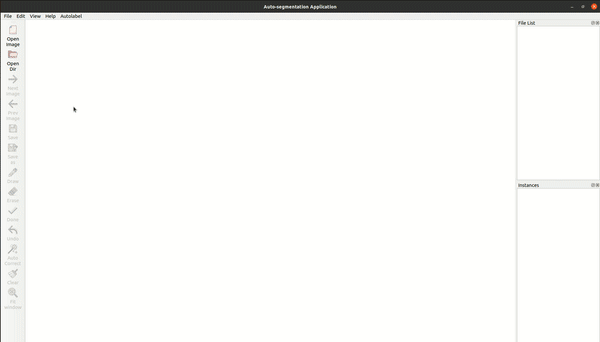
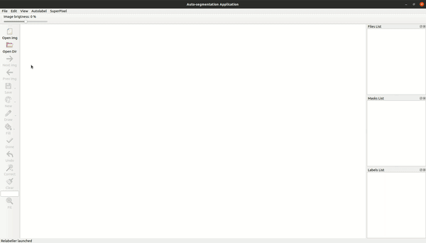
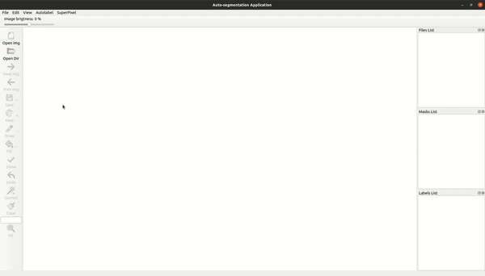
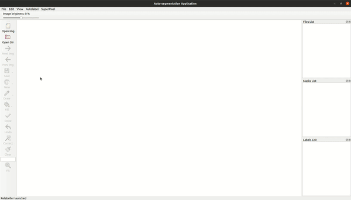
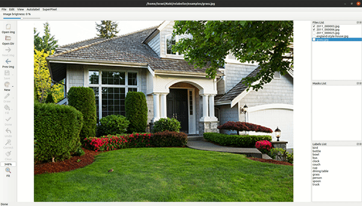
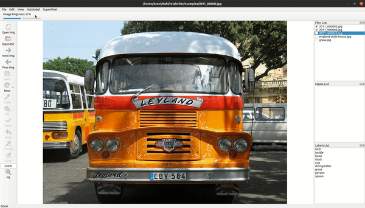
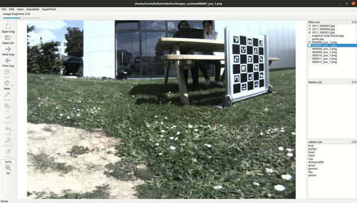
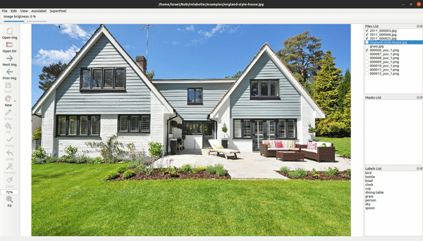
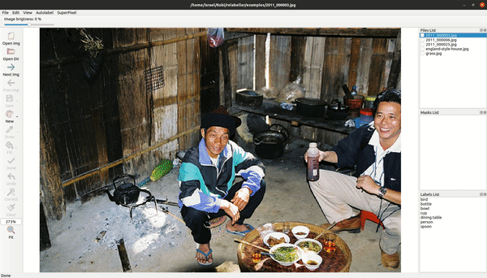
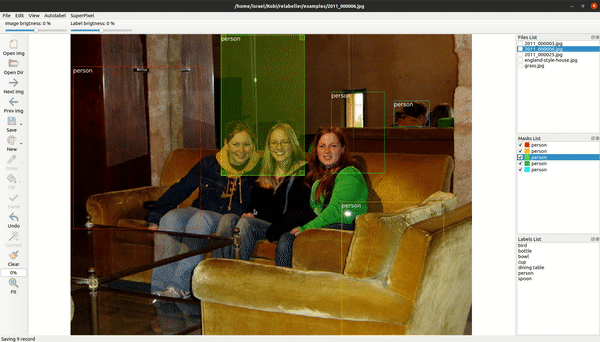

<h4 align="center">
  RELABELLER
</h4>


<div align="center">
  <a href="#Description"><b>Description</b></a> |
  <a href="#Features"><b>Features</b></a> |
  <a href="#Requirements"><b>Requirements</b></a> |
  <a href="#Installation"><b>Installation</b></a> |
  <a href="#usage"><b>Usage</b></a>
</div>


## Description
Relabeller is a graphical image annotation tool designed to speed-up the annotation process using state-of-the-art pre-trained models from Pytorch. It is written in Python3 and uses Qt5 for its graphical interface.

<div align="center">
  
  <p align="center" ><i>Example of instance segmentation.</i></p>
</div>


## Features
- Directory Managing
<div align="center">
  
  
  
  <p align="center" ><i>Openning simple image, annotated image, and a directory w & w/o annotations</i></p>
</div>

- Auto-segmentation using a pretrained models
<div align="center">
    
  <p align="center" ><i>Image segmentation using a custom model, a standard pre-trained model, and a combination of both</i></p>
</div>

- SuperPixel segmentation using sklearn
<div align="center">
    <p align="center" ><i>Segmentation using superpixel annotation tools from Sklearn</i></p>
</div>

- Auto-boundingbox generation using pre-trainded models
<div align="center">
    <p align="center"> <i>Bounding Box creation, prediction, and modification</i></p>
</div>

- Image annotation (drawing, erasing)

- Auto-correction using pixel aggregation (Skimage)
- GUI customization

## Requirements
- Python3
- Torch and TorchVision
- Onnx Runtime
- PyQt5
- pycocotools
- Scikit-learn, Scikit-image, imageio
- matplotlib, numpy

## Installation
### Anaconda
### Ubuntu
```
In a fresh environment
sudo apt-get install python3-pyqt5
pip install matplotlib numpy scikit-image imageio scikit-learn onnxruntime
git clone https://github.com/TheKobiCompany/relabeller.git
cd relabeller/
Install pytorch depending on your environment (https://pytorch.org/get-started/locally/)
```
### Windows


## Usage
Run `python main.py`

The annotated images are saved in `.json` [labelme](https://github.com/wkentaro/labelme/) format.

## Authors
* [Israel Tiñini Alvarez](mailto:i.tinini.a@gmail.com)
* [Benjamin Pinaya](mailto:benjamin@thekobi.com)

## Cite This Project

If you use this project in your research or wish to refer to the baseline results published in the README, please use the following BibTeX entry.

```bash
@misc{relabeller,
  author =       {Israel Tiñini and Benjamin Pinaya},
  title =        {relabeller: Intelligent segmentation tool},
  howpublished = {\url{https://github.com/IsRaTiAlv/relabeller}},
  year =         {2020}
}
```
